# DFD — BLE Mesh Transport

## Overview

The Bluetooth LE mesh transport provides multi-hop message delivery within proximity networks. It operates independently of the internet — devices discover peers via BLE advertisements and relay messages using a flood/route hybrid with TTL limiting.

**Key implementation references:**
- `app/src/main/java/com/meshcipher/data/bluetooth/BluetoothMeshManager.kt`
- `app/src/main/java/com/meshcipher/data/bluetooth/AdvertisementData.kt`
- `app/src/main/java/com/meshcipher/data/bluetooth/GattServerManager.kt`
- `app/src/main/java/com/meshcipher/data/bluetooth/GattClientManager.kt`
- `docs/bluetooth_mesh.md`

---

## BLE Advertisement Format

Each active device continuously broadcasts an advertisement packet (130 bytes):

```
[1B: protocol version (0x01)]
[1B: message type — BEACON(0x01) | DATA(0x02) | ROUTE_UPDATE(0x03)]
[32B: SHA-256(deviceId)]
[32B: SHA-256(userId)]
[64B: ECDSA signature over above fields]
```

Service UUID: `00001234-0000-1000-8000-00805F9B34FB` (custom MeshCipher UUID — static, known to any scanner).

---

## MeshMessage Binary Format

```kotlin
MeshMessage {
    id: String           // UUID (message dedup)
    originDeviceId: String
    originUserId: String
    destinationUserId: String
    timestamp: Long
    ttl: Int             // default 5, decremented at each hop
    hopCount: Int        // incremented at each hop
    path: String         // comma-separated deviceIds of relay path
    encryptedPayload: ByteArray  // Signal Protocol ciphertext
}
```

Wire: `ByteBuffer` with length-prefixed strings and 4-byte integers.

---

## DFD — BLE Mesh

```mermaid
flowchart TD
    subgraph DeviceA["Device A (Sender)"]
        APP_A([Android App])
        BLE_A([BLE Radio])
    end

    subgraph MeshCloud["BLE Mesh (multi-hop, untrusted)"]
        NODE1([Relay Node 1\nDeviceId_R1])
        NODE2([Relay Node 2\nDeviceId_R2])
        EVIL([Sybil Node\nAdversary-controlled])
    end

    subgraph DeviceB["Device B (Recipient)"]
        BLE_B([BLE Radio])
        APP_B([Android App])
    end

    subgraph PassiveScanner["Passive Scanner\n(any BLE device in range)"]
        SCAN([BLE Scanner\nno authentication required])
    end

    %% Advertisement broadcast (all nearby devices receive this)
    APP_A -- "Continuous BLE advertisement\nSHA-256(deviceId_A) | SHA-256(userId_A)\nservice UUID | TX power\n[PASSIVELY OBSERVABLE BY ALL]" --> BLE_A
    BLE_A -. "RF broadcast" .-> SCAN
    BLE_A -. "RF broadcast" .-> NODE1
    BLE_A -. "RF broadcast" .-> EVIL

    %% GATT message relay
    APP_A -- "MeshMessage\n{originDeviceId_A, originUserId_A,\ndestinationUserId_B,\npath=[], ttl=5, hopCount=0,\nSignal ciphertext}" --> NODE1
    NODE1 -- "path=[R1], ttl=4, hopCount=1\n[NODE1 reads: origin, dest, size, timing]" --> NODE2
    NODE2 -- "path=[R1,R2], ttl=3, hopCount=2\n[NODE2 reads: origin, dest, size, timing]" --> BLE_B
    BLE_B --> APP_B

    %% Sybil path
    BLE_A -. "MeshMessage (copy)" .-> EVIL
    EVIL -. "path=[Sybil], ttl=4, hopCount=1\n[Sybil reads: origin, dest, size,\ntiming; can correlate across nodes]" .-> NODE2
```



---

## Trust Boundary Analysis

| Boundary | Crossed by | Observable to adversary at boundary |
|----------|-----------|-------------------------------------|
| Device A radio ↔ BLE medium | Every advertisement | SHA-256(deviceId), SHA-256(userId), messageType, service UUID, TX power, RSSI, timestamp |
| GATT sender ↔ GATT server (each hop) | MeshMessage | originDeviceId, originUserId, destinationUserId, message size, timestamp, hop count, full routing path so far |
| App process ↔ Android BLE stack | Internal | N/A — OS trusted |

---

## Security Properties

| Property | Status | Notes |
|----------|--------|-------|
| Message content confidentiality | Achieved | Signal E2E — relay nodes cannot decrypt |
| Sender/recipient content isolation | Achieved | Signal E2E |
| Presence hiding | Gap | SHA-256 hashes are **stable** — same hash on every advertisement; enables passive presence tracking |
| Social graph protection | Gap | Co-presence of two hashed IDs over time builds adjacency graph without decryption |
| Routing metadata hiding | Gap | `path` field in MeshMessage is plaintext — every relay hop sees full accumulated route |
| Replay protection | Partial | UUID-based dedup; TTL limits propagation; no cryptographic binding of TTL to content |
| Sybil resistance | Gap | No attestation of relay nodes; adversary can operate multiple nodes to increase traffic analysis coverage |
| Device identifier rotation | Gap | SHA-256(deviceId) is deterministic and stable — no rotation mechanism identified in codebase |

---

## Key Threat Vectors

1. **Passive BLE scanning** — any device within ~30m range continuously collects advertisements. Over time, builds a presence timeline for each stable hash.
2. **Path field exposure** — compromised relay nodes read the accumulated routing path, learning which devices are within range of each other.
3. **Sybil attack** — adversary operates multiple relay nodes at strategic locations. Each node individually observes partial routes; correlation across nodes reconstructs end-to-end routing even without decryption.
4. **TTL manipulation** — relay node could modify TTL or hop count to affect delivery or suppress messages (DoS).
5. **GATT characteristic flooding** — adversary connects to a target GATT server and floods the Message characteristic, causing DoS.

Full STRIDE analysis: `03-stride-analysis/stride-bluetooth-mesh.md`
Full attack tree (metadata leakage, Sybil): `04-attack-trees/at-ble-metadata-leakage.md`
