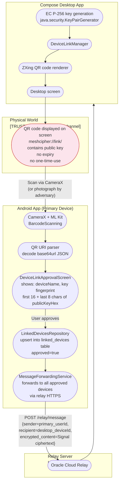

# DFD — Linked Device Enrolment

## Overview

MeshCipher supports linking a Compose Desktop companion app to the primary Android device via QR code. The enrolment flow transfers the desktop's EC P-256 public key to the Android device, which stores it and forwards received messages via the relay.

**Key implementation references:**
- `desktopApp/src/main/kotlin/com/meshcipher/desktop/data/DeviceLinkManager.kt`
- `app/src/main/java/com/meshcipher/presentation/linking/DeviceLinkApprovalScreen.kt`
- `app/src/main/java/com/meshcipher/presentation/linking/QRScannerScreen.kt`
- `app/src/main/java/com/meshcipher/data/repository/LinkedDevicesRepository.kt`
- `shared/src/commonMain/kotlin/com/meshcipher/shared/domain/model/LinkedDevice.kt`

---

## QR Code Content

```json
{
  "deviceId": "<UUID>",
  "deviceName": "<hostname>",
  "deviceType": "DESKTOP",
  "publicKeyHex": "<64 hex chars — EC P-256 public key>",
  "timestamp": 1234567890000
}
```

Encoded as: `meshcipher://link/<base64url(JSON)>`

Rendered as QR code by ZXing on the desktop screen. Displayed until scanned or dismissed — **no one-time-use enforcement**.

---

## Enrolment Flow DFD



---

## LinkedDevice Database Record

```kotlin
@Entity(tableName = "linked_devices")
data class LinkedDeviceEntity(
    @PrimaryKey val deviceId: String,    // UUID from QR
    val deviceName: String,              // hostname from QR
    val deviceType: String,              // "DESKTOP"
    val publicKeyHex: String,            // full EC P-256 pubkey (64 hex chars)
    val linkedAt: Long,                  // Unix ms
    val approved: Boolean                // user approval flag
)
```

---

## Trust Boundary Analysis

| Boundary | Crossed by | Risk |
|----------|-----------|------|
| Desktop screen → Android camera | QR code (visual channel) | Any observer with camera access can capture QR; no secrecy of QR content |
| Android app → `linked_devices` DB | Approval action | DB is SQLCipher-encrypted; protected at rest |
| Android app → relay → desktop | Message forwarding | Relay sees communication events; content is Signal-encrypted |

---

## Security Properties

| Property | Status | Notes |
|----------|--------|-------|
| Key authenticity | Partial | User sees 24-char fingerprint of publicKeyHex; must visually verify. No out-of-band confirmation. |
| QR one-time-use | Gap | Same QR displayed until dismissed — no nonce, no expiry enforcement in code |
| QR replay window | Gap | `timestamp` field present in payload but not validated for freshness in current implementation |
| Binding to specific Android device | Gap | Any Android device that scans the QR and approves becomes a linked device — no binding to intended scanner |
| Desktop confirmation | Gap | No confirmation flow back to desktop — Android approves unilaterally; desktop not notified of successful link |
| Rogue device registration | Gap | Adversary who photographs QR can approve it on their own Android device, receiving forwarded messages |
| Message forwarding encryption | Achieved | Messages forwarded via Signal E2E — relay and rogue linked devices cannot read content unless they hold the session keys |

---

## Critical Gap: Rogue Linked Device Attack

Because:
1. The QR code has no one-time-use enforcement
2. There is no binding to a specific Android device
3. Approval is unilateral (Android-side only)

An attacker who can **photograph or screengrab the QR code** during the enrolment window can register their own device as a linked device. Once registered, `MessageForwardingService` will forward all incoming messages to the attacker's device ID via the relay.

The attacker would receive Signal-encrypted ciphertext — they cannot read it without the sender's session keys — but they gain confirmation of:
- When messages arrive (timing oracle)
- Message sizes
- Sender IDs (pseudonymous)

Full STRIDE analysis: `03-stride-analysis/stride-linked-devices.md`
Full attack tree: `04-attack-trees/at-linked-device-enrolment.md`
