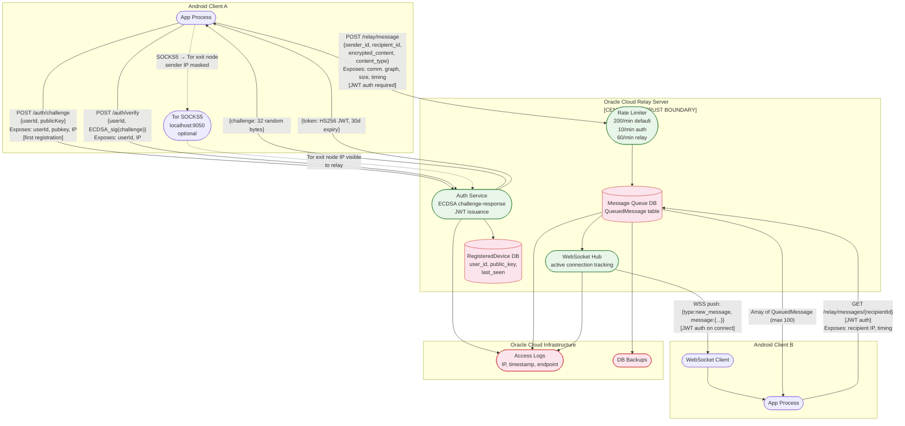

# DFD — Relay Server (Oracle Cloud)

## Overview

The Oracle Cloud relay server is the **only centralised component** in MeshCipher. It provides store-and-forward message queuing and real-time WebSocket push delivery. The relay cannot decrypt message content (Signal E2E), but has full visibility into the communication metadata graph.

**Key implementation references:**
- `relay-server/server.py`
- `app/src/main/java/com/meshcipher/data/transport/InternetTransport.kt`
- `docs/networking.md`

---

## Relay Server Data Model

```python
# QueuedMessage
sender_id: str        # SHA-256(publicKey)[:32] — pseudonymous
recipient_id: str     # SHA-256(publicKey)[:32] — pseudonymous
encrypted_content: str  # Base64-encoded Signal ciphertext
content_type: int     # 0=text, 1=media
queued_at: datetime
delivered: bool
delivered_at: datetime | None

# RegisteredDevice
user_id: str          # pseudonymous (same as sender/recipient IDs)
device_id: str        # device UUID (opaque)
public_key: str       # EC P-256 public key — registered at first auth
registered_at: datetime
last_seen: datetime   # updated on each authenticated request
```

---

## DFD — Relay Server



---

## What the Relay Operator Can Observe

Even with perfect Signal E2E encryption, the relay operator has full access to:

| Observable | Detail | Threat |
|------------|--------|--------|
| sender_id ↔ recipient_id pairs | Every message queued | Communication graph — who talks to whom |
| Message timing | `queued_at`, `delivered_at` per message | Activity patterns, relationship inference |
| Message frequency | Count per sender/recipient pair over time | Relationship intensity, burst patterns |
| Content type | Text (0) vs. media (1) | Behavioural inference |
| Message size | `len(encrypted_content)` | Approximate plaintext size despite encryption |
| Sender IP address | HTTP request source IP (unless Tor) | Geolocation, ISP, correlation with other services |
| WebSocket connection events | `last_seen` per device, connection/disconnection timestamps | Online presence tracking |
| Registration events | `registered_at`, `public_key` per device | Device lifecycle |
| JWT authentication events | Frequency, timing of token refreshes | Session patterns |

**The relay operator cannot observe:** plaintext message content, sender display names, contact lists stored on device, Signal session keys.

---

## Rate Limits and Security Controls

| Control | Value | Threat it addresses |
|---------|-------|---------------------|
| Default rate limit | 200/min | General DoS |
| Auth endpoint | 10/min | Brute-force / enumeration |
| Relay endpoint | 60/min | Message flooding |
| Max queued messages per recipient | 500 | Mailbox flooding DoS |
| Max request body | 10 MB | Large payload DoS |
| JWT expiry | 30 days | Token reuse after compromise |
| Sender_id validation | JWT user_id must match sender_id | Impersonation via relay |
| Recipient isolation | Only fetch/ack own messages | Unauthorized message access |

**Missing controls:**
- No certificate pinning on client (noted in `SECURITY_AUDIT_GUIDE.md`)
- Relay server HS256 JWT secret — if leaked, all tokens forgeable
- No mutual TLS between client and relay
- No message padding to conceal sizes

---

## Trust Boundary: Relay Server

The relay server is a **semi-trusted** component — trusted for availability and correct routing, **not trusted** for confidentiality of metadata. The threat model treats the relay operator as a potential adversary for metadata analysis purposes.

Full STRIDE analysis: `03-stride-analysis/stride-relay-server.md`
Full attack tree (relay compromise): `04-attack-trees/at-relay-server-compromise.md`
