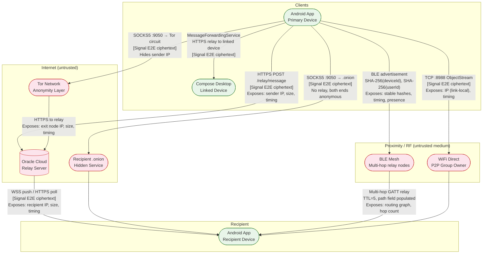

# DFD — Level 0: System Overview

## Context

This is the Level 0 (context) Data Flow Diagram for MeshCipher. It shows all external entities, the five active transport paths, and the trust boundaries they cross. All message flows carry Signal Protocol ciphertext — E2E encryption is end-to-end across all transports.

Signal E2E boundary notation: flows labelled `[Signal E2E]` are encrypted at the application layer before leaving the process. The relay server, BLE mesh nodes, and Tor network can observe the outer envelope (headers, sizes, timing) but **cannot decrypt content**.

## Level 0 DFD

## Trust Boundary Summary

| Boundary | Crossed by | What adversary at boundary can observe |
|----------|-----------|----------------------------------------|
| Android app process ↔ internet | Internet relay, Tor, P2P Tor | IP address (non-Tor), message sizes, timestamps, sender/recipient IDs (pseudonymous) |
| Android app process ↔ BLE radio | BLE mesh | SHA-256(deviceId), SHA-256(userId), timing, service UUID, TX power, RSSI |
| Android app process ↔ WiFi Direct | WiFi Direct | Link-local IP, message sizes, timing |
| Relay server ↔ client | All internet transports | Same as internet boundary above; plus: registration public key, JWT auth events |
| BLE mesh node ↔ next hop | Mesh relay | All fields in `MeshMessage`: originDeviceId, originUserId, destinationUserId, path, hop count |

## Data Flows — Enumeration

### DF-01: Message send via Internet relay (direct)
- **Source:** Android app
- **Destination:** Oracle Cloud relay server → recipient Android
- **Data:** `POST /api/v1/relay/message` — `{sender_id, recipient_id, encrypted_content (Base64), content_type}`
- **Sensitivity:** sender_id and recipient_id are pseudonymous (SHA-256 hash prefixes); encrypted_content is Signal ciphertext. Relay sees communication graph and sizes.
- **Reference:** `relay-server/server.py`, `app/.../transport/InternetTransport.kt`

### DF-02: Message send via Internet relay + Tor (SOCKS5)
- **Source:** Android app → `localhost:9050` SOCKS5 (Orbot)
- **Destination:** Oracle Cloud relay server → recipient
- **Data:** Same as DF-01; sender IP is masked to Tor exit node IP
- **Reference:** `app/.../transport/InternetTransport.kt` (Tor proxy variant)

### DF-03: P2P Tor hidden service message
- **Source:** Android app SOCKS5 client → recipient's `.onion` address
- **Destination:** Recipient's `HiddenServiceServer` (ephemeral local port)
- **Data:** `P2PMessage` (length-prefixed JSON): `{type, messageId, senderId, recipientId, timestamp, payload (Base64 Signal ciphertext)}`
- **Sensitivity:** Both endpoints hidden; Tor network sees only encrypted Tor cells
- **Reference:** `app/.../tor/P2PClient.kt`, `app/.../tor/HiddenServiceServer.kt`

### DF-04: BLE mesh advertisement
- **Source:** Android app (`BluetoothMeshManager`)
- **Destination:** All BLE-scanning devices within range
- **Data:** `AdvertisementData`: `[protocolVersion(1B)] [messageType(1B)] [SHA-256(deviceId)(32B)] [SHA-256(userId)(32B)] [ECDSA_signature(64B)]` = 130 bytes
- **Sensitivity:** Hashes are stable identifiers — enable presence tracking and social graph inference
- **Reference:** `app/.../bluetooth/AdvertisementData.kt`, `app/.../bluetooth/BluetoothMeshManager.kt`

### DF-05: BLE mesh GATT message relay
- **Source:** Android app GATT client
- **Destination:** Peer GATT server → next hop → … → destination
- **Data:** `MeshMessage`: `{id, originDeviceId, originUserId, destinationUserId, timestamp, ttl(default 5), hopCount, path (comma-separated deviceIds), encryptedPayload}`
- **Sensitivity:** path field reveals routing graph; originDeviceId/destinationUserId visible to every hop
- **Reference:** `app/.../bluetooth/BluetoothMeshManager.kt`

### DF-06: WiFi Direct P2P message
- **Source:** Android app TCP client (port 8988)
- **Destination:** Group Owner `ServerSocket` → peer
- **Data:** `TextMessage {senderId, recipientId, timestamp, encryptedContent}` via Java `ObjectOutputStream`
- **Sensitivity:** Link-local IP visible; Java serialization surface
- **Reference:** `app/.../wifidirect/`

### DF-07: Linked device forwarding
- **Source:** `MessageForwardingService` on primary Android
- **Destination:** Desktop app via relay HTTPS
- **Data:** Same Signal ciphertext forwarded to all `approved=true` entries in `linked_devices` DB
- **Reference:** `app/.../service/MessageForwardingService.kt`

### DF-08: Relay authentication (challenge-response)
- **Source:** Android app
- **Destination:** Relay server
- **Data:** `POST /auth/challenge {userId, publicKey(Base64)}` → `{challenge(32B)}` → `POST /auth/verify {userId, signature(Base64)}` → `{token: JWT}`
- **Sensitivity:** Relay learns userId + public key on first registration; JWT valid 30 days
- **Reference:** `relay-server/server.py` (`/api/v1/auth/*`)

### DF-09: QR device enrolment
- **Source:** Desktop app (`DeviceLinkManager`)
- **Destination:** Android app (via camera QR scan)
- **Data:** `meshcipher://link/<base64url({deviceId, deviceName, deviceType, publicKeyHex, timestamp})>`
- **Sensitivity:** Public key transmitted in QR — visible to anyone who can photograph the screen
- **Reference:** `desktopApp/.../DeviceLinkManager.kt`, `app/.../presentation/linking/`
