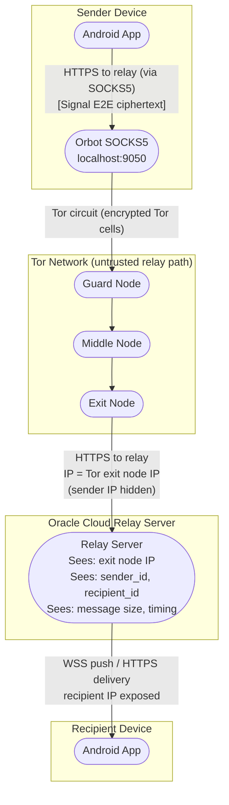
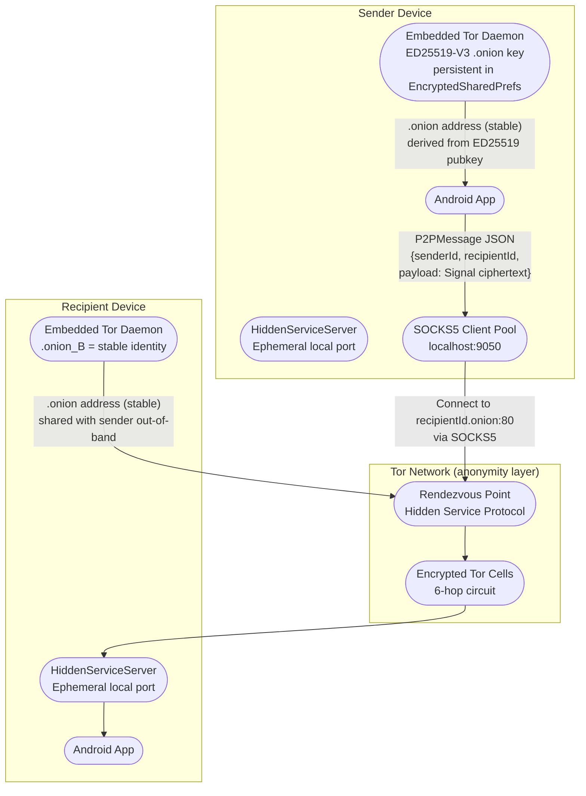

# DFD — Tor Transport (Relay via Tor + P2P Hidden Service)

## Overview

MeshCipher supports Tor in two distinct modes:

1. **Relay-via-Tor** — routes internet relay traffic through the local Tor SOCKS5 proxy (Orbot on Android), masking the sender's IP from the relay server.
2. **P2P Tor hidden service** — both endpoints operate `.onion` services (ED25519-V3). No relay server involved; traffic flows directly through the Tor network. Both sender and recipient IPs are hidden from each other and from network observers.

**Key implementation references:**
- `app/src/main/java/com/meshcipher/data/tor/EmbeddedTorManager.kt`
- `app/src/main/java/com/meshcipher/data/tor/HiddenServiceServer.kt`
- `app/src/main/java/com/meshcipher/data/tor/P2PClient.kt`
- `app/src/main/java/com/meshcipher/data/tor/P2PConnectionManager.kt`
- `docs/p2p_tor.md`

---

## P2P Tor Wire Format

```kotlin
P2PMessage {
    type: Type      // TEXT | MEDIA | ACK | PING | PONG
    messageId: String
    senderId: String
    recipientId: String
    timestamp: Long
    payload: String?  // Base64-encoded Signal ciphertext (null for ACK/PING/PONG)
}
// Serialization: [4B big-endian length][N bytes UTF-8 JSON]
```

---

## Mode 1: Relay-via-Tor DFD



**Anonymity properties (Mode 1):**
- Sender IP is hidden from relay server (exit node IP visible)
- Relay still observes: sender_id, recipient_id, message size, timing, content_type
- Recipient IP still exposed to relay (unless recipient also uses Tor)
- Tor guard node knows sender's real IP but not destination

---

## Mode 2: P2P Tor Hidden Service DFD



**Anonymity properties (Mode 2):**
- No relay server involved — zero metadata to centralised component
- Both endpoint IPs are hidden from each other and from Tor relays
- Tor only sees encrypted cells; cannot distinguish sender or recipient content
- Guard node of sender knows sender's IP but not destination `.onion`
- Recipient's guard node knows recipient's IP but not sender's IP

**Residual risks (Mode 2):**
- Stable `.onion` address is a long-term pseudonymous identifier — consistent across sessions
- Timing correlation: global passive adversary with visibility into both sender's and recipient's guard nodes can perform traffic analysis
- `.onion` key stored in `EncryptedSharedPreferences` — if device compromised, attacker recovers stable hidden service identity

---

## Hidden Service Key Storage

```
Key type: ED25519-V3
Storage: EncryptedSharedPreferences (AES-256-GCM, Keystore-backed)
Persistence: Survives app restart — same .onion address on every boot
Recovery: Key lost on Keystore wipe (new install, biometric enrollment change)
```

**Threat:** Unlike ephemeral `.onion` services, MeshCipher uses a persistent key, which means:
- The `.onion` address is a stable, long-term pseudonym
- Any party who knows your `.onion` address can determine when your service is online
- If the ED25519 private key is extracted from EncryptedSharedPreferences (e.g., via ADB backup on non-encrypted device, or rooted device), the attacker can impersonate the hidden service

---

## Transport Selection Context

From `docs/networking.md`, P2P Tor is the highest-preference transport in `TOR_RELAY` and `P2P_TOR` modes:

```
TOR_RELAY mode: P2P Tor → WiFi Direct → Internet (SOCKS5) → BLE
P2P_TOR mode:  P2P Tor → WiFi Direct → BLE
```

The app falls back to the next available transport if P2P Tor bootstrap fails or the recipient is not reachable via `.onion`.

Full STRIDE analysis: `03-stride-analysis/stride-tor-transport.md`
