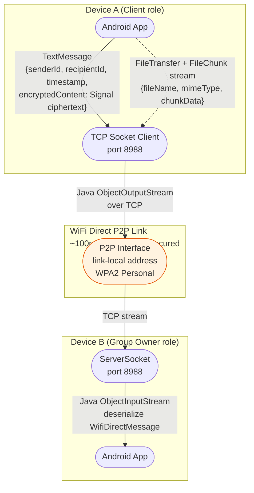

# DFD — WiFi Direct Transport

## Overview

WiFi Direct provides medium-range (~100 m) P2P connectivity without a WiFi infrastructure access point. Android's P2P stack assigns one device as Group Owner (GO) and the other as client. MeshCipher uses a TCP socket on port 8988 bound to the GO's P2P interface address.

**Key implementation references:**
- `app/src/main/java/com/meshcipher/data/wifidirect/`
- `docs/wifi_direct.md`

---

## Connection Protocol

1. Both devices must actively scan for peers simultaneously (no passive discovery)
2. Android OS negotiates Group Owner role (not deterministic — OS decides)
3. GO binds `ServerSocket(port=8988, bind="127.0.0.1")` — note: bound to loopback; actual P2P address is link-local
4. Client connects: `Socket().connect(groupOwnerAddress, 8988)`
5. `ObjectInputStream` / `ObjectOutputStream` over the TCP stream (Java Serializable)

---

## Wire Protocol

```kotlin
// Sealed class transmitted via ObjectOutputStream
sealed class WifiDirectMessage : Serializable {
    data class TextMessage(
        val senderId: String,
        val recipientId: String,
        val timestamp: Long,
        val encryptedContent: ByteArray  // Signal ciphertext
    ) : WifiDirectMessage()

    data class FileTransfer(
        val senderId: String,
        val recipientId: String,
        val fileId: String,
        val fileName: String,
        val fileSize: Long,
        val mimeType: String,
        val totalChunks: Int
    ) : WifiDirectMessage()

    data class FileChunk(
        val fileId: String,
        val chunkIndex: Int,
        val chunkData: ByteArray
    ) : WifiDirectMessage()

    data class Ack(
        val fileId: String,
        val chunkIndex: Int
    ) : WifiDirectMessage()
}
```

---

## DFD — WiFi Direct



---

## Trust Boundary Analysis

| Boundary | Observable to adversary |
|----------|------------------------|
| P2P radio medium (WPA2) | WPA2 provides link-layer encryption — passive RF eavesdropping requires WPA2 key |
| P2P interface ↔ OS | Link-local IP address of both devices exposed via P2P group info (Android WifiP2pInfo) |
| TCP stream ↔ app | Java serialization stream — deserialization of arbitrary objects if attacker can inject into stream |

---

## Security Properties

| Property | Status | Notes |
|----------|--------|-------|
| Content confidentiality | Achieved | Signal E2E on top of WPA2 link-layer |
| IP address exposure | Partial | Link-local IP visible to P2P group; not routable beyond the P2P group |
| Java deserialization risk | Gap | `ObjectInputStream.readObject()` on untrusted data — if attacker can influence stream content, arbitrary class instantiation possible |
| Group Owner role determinism | Accepted risk | OS-assigned role; cannot guarantee which device acts as GO — affects connection reliability, not security |
| Certificate pinning | N/A | No TLS on this transport |
| No relay involvement | Achieved | Fully offline P2P — relay server has zero visibility |

---

## Key Threat Vectors

1. **Java deserialization** — `ObjectInputStream` deserializes whatever the peer sends. A malicious peer (or MITM who can intercept the WPA2-protected stream) could send a crafted gadget chain. Mitigated in practice by the WPA2 link-layer, but the deserialization surface is an unnecessary risk (should use a typed binary format).
2. **Link-local IP discovery** — the Group Owner's IP is shared with the client via `WifiP2pInfo.groupOwnerAddress`. This is unavoidable but means IP is visible within the session.
3. **Discovery timing** — both devices must actively scan simultaneously, creating a coordination window that could be used for presence detection by a monitoring adversary who can observe WiFi scan events.

Full STRIDE analysis: `03-stride-analysis/stride-wifi-direct.md`
