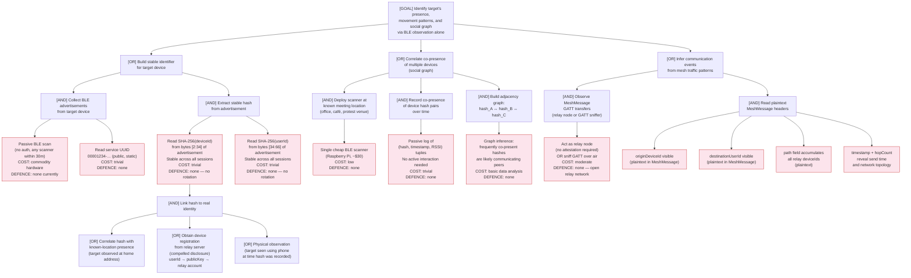

# Attack Tree — BLE Metadata Leakage / Presence Tracking

**Attacker goal:** Determine presence, movement patterns, and social graph of a target MeshCipher user via passive BLE observation, without decrypting any message content.

**Adversary model:** Local adversary with BLE scanning capability (commodity hardware, ~30m range). No cryptographic capability required. May be stationary (building sensor, checkpoint) or mobile (following target).

---

## Attack Tree

---

## Attack Scenario Narrative

**Step 1 — Deploy passive scanner.** Adversary places a Raspberry Pi with BLE adapter at a location the target is expected to visit (office building entrance, transit hub, protest venue). The scanner continuously logs `(SHA-256(deviceId), SHA-256(userId), timestamp, RSSI, messageType)` tuples from any MeshCipher advertisement (identifiable by service UUID `00001234-…`).

**Step 2 — Build presence timeline.** Over days or weeks, the adversary accumulates a timestamped record of when each stable hash was observed at the scanning location. No decryption required.

**Step 3 — Social graph construction.** By deploying multiple scanners or by analysing co-presence data from a single scanner, the adversary identifies pairs of hashes that appear together frequently. These pairs likely represent communicating peers (friends, colleagues, organising groups).

**Step 4 — Deanonymisation.** The adversary anchors one hash to a real identity by physical observation (see target at a known-location scanner, match time of observation with hash appearance). Once one node in the graph is identified, the social network reveals additional identities.

**Step 5 — Communication event inference.** If the adversary can act as a BLE relay node, they gain access to the plaintext `MeshMessage` headers — explicit sender and recipient IDs, timestamps, message sizes, and routing paths — confirming and enriching the social graph with communication events.

---

## Mitigations

| Control | Status | Notes |
|---------|--------|-------|
| SHA-256 hashing of IDs in advertisements | Implemented | Prevents direct identity disclosure but hashes are stable — does not prevent tracking |
| Identifier rotation (epoch-based pseudonyms) | Gap | Not implemented; would be the primary mitigation for presence tracking |
| Randomised service UUID per session | Gap | Static UUID `00001234-…` identifies the app to any scanner |
| Removal of `path` field from MeshMessage | Gap | Path field leaks routing graph to every relay hop |
| Encryption of MeshMessage headers | Gap | originDeviceId, destinationUserId are plaintext in every relayed message |
| Relay node attestation | Gap | No mechanism to verify relay nodes are honest |

---

## Residual Risk

Even with identifier rotation implemented, a motivated adversary with multiple scanners at strategic locations can correlate rotated identifiers using timing and RSSI patterns if the rotation period is too long or if the device moves predictably between scanner coverage areas. Rotation is a mitigation, not a complete defence against a well-resourced local adversary.
