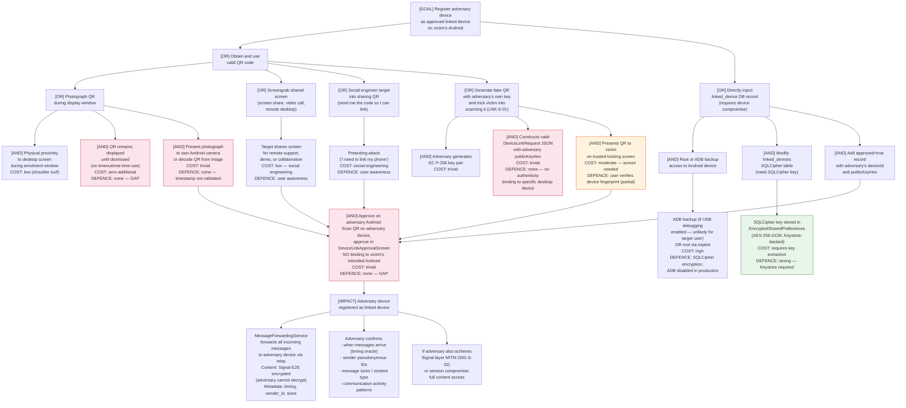

# Attack Tree — Linked Device Enrolment Attack

**Attacker goal:** Register an adversary-controlled device as an approved linked device on the victim's primary Android, causing all forwarded messages to also be delivered to the adversary.

**Adversary models:**
- A: **Opportunistic observer** — can briefly see the desktop screen during enrolment (shoulder surfing, shared screen)
- B: **Physical access adversary** — brief physical access to desktop or Android during or after enrolment
- C: **Network/relay adversary** — can observe relay traffic after rogue device is registered

---

## Attack Tree

---

## Attack Scenario Narratives

### Scenario A: Shoulder Surf + Photograph (Opportunistic, Low Sophistication)

Target is linking their laptop to their phone at a coffee shop. Adversary is seated nearby. During the ~30 seconds the QR is displayed, adversary takes a photo with their phone. Later, they decode the QR image using a free QR scanner app, extract the `meshcipher://link/…` URI, open the app on their own Android, scan their photo, and approve the device in `DeviceLinkApprovalScreen`. The entire attack requires no technical skill and no cryptographic capability. From this point, `MessageForwardingService` delivers all incoming messages to both the target's laptop and the adversary's phone.

**Key enablers:** No one-time-use nonce; `timestamp` field not validated for freshness; no binding to specific Android device.

### Scenario B: Fake QR (Active, Moderate Sophistication)

Adversary generates an EC P-256 key pair and constructs a valid `DeviceLinkRequest` JSON payload with their own `publicKeyHex`. Renders it as a QR code on their own screen. Via social engineering (pretending to be IT support, a colleague wanting to test the app), persuades the target to scan this QR. The target's `DeviceLinkApprovalScreen` shows the adversary's `deviceName` (whatever they configured) and a truncated fingerprint. If the target approves, the adversary's device is linked. The only defence is the user recognising that the fingerprint doesn't match their actual laptop.

**Key enabler:** QR validation only checks JSON structure and presence of fields; it does not verify that the QR originated from a device the user has any prior relationship with.

---

## Mitigations

| Control | Status | Priority |
|---------|--------|----------|
| One-time-use nonce in QR (server or session validated) | Gap | High |
| Timestamp freshness validation (e.g., reject if > 5 minutes old) | Gap | High |
| Desktop confirmation step (Android sends approval, desktop must confirm) | Gap | High |
| Full public key fingerprint display (vs. 24-char truncation) | Gap | Medium |
| QR expiry timer (auto-dismiss after 60s) | Gap | Medium |
| Binding QR to session (only scannable by a device that has pre-authenticated) | Gap | Low — complex UX |
