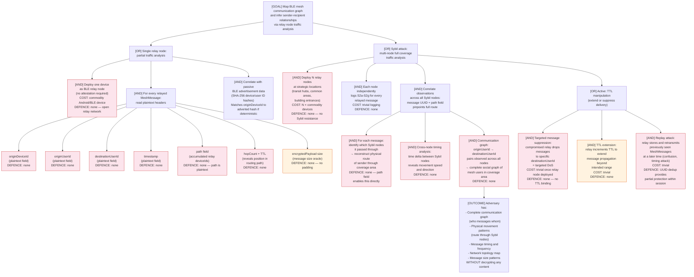

# Attack Tree — Mesh Relay Node Traffic Analysis

**Attacker goal:** Determine the communication graph (who is messaging whom), message timing patterns, and network topology of a BLE mesh by operating one or more relay nodes — without decrypting any Signal Protocol content.

**Adversary models:**
- A: **Single malicious relay node** — one adversary-controlled device acting as a BLE relay hop
- B: **Sybil attacker** — adversary operates multiple relay nodes distributed across the mesh coverage area to increase traffic analysis coverage and enable cross-node correlation

---

## Attack Tree

---

## Attack Scenario Narratives

### Scenario A: Single Relay Node (Partial Coverage)

Adversary carries an Android device that participates in the BLE mesh as a relay. For every MeshMessage it relays, it logs the full header in plaintext — sender, recipient, timestamp, message size, and the routing path. Within a single venue (protest, meeting, transit hub), the adversary quickly maps which users are present and communicating. Cost: one Android device and a simple logging app. No cryptography involved.

**Coverage limitation:** Single relay node only sees messages that physically route through it. Messages between devices that don't need this relay hop are invisible.

### Scenario B: Sybil Attack (Full Coverage)

Adversary deploys 5–10 low-cost BLE devices (commodity Android phones or Raspberry Pi + BLE adapters) across a target area — e.g., at multiple entrances/exits of a building, or across key transit nodes in a city neighbourhood. Each Sybil node acts as a willing relay hop.

Because the BLE mesh uses flood/route hybrid routing (TTL=5), most messages traverse multiple hops. The probability that at least one hop is a Sybil node increases with the density of Sybil nodes. With 5 nodes spread across a mesh of 20 honest nodes, a rough estimate suggests >60% of messages traverse at least one Sybil node.

**The `path` field is the key enabler.** When a message passes through two Sybil nodes, both log the same message UUID, different timestamps, and different `path` field snapshots. Correlation by UUID reconstructs the full route and physical movement of the sender between node locations.

**Result:** Without decrypting a single byte of Signal content, the adversary produces a detailed social and movement graph of all MeshCipher users in their coverage area.

---

## Mitigations

| Control | Status | Priority | Notes |
|---------|--------|----------|-------|
| Encrypt MeshMessage routing headers | Gap | High | Prevent relay nodes from reading sender/recipient/path in cleartext |
| Remove or onion-encrypt the `path` field | Gap | High | Path field is the primary enabler for multi-node correlation |
| Relay node attestation / trust establishment | Gap | Medium | Prevent arbitrary devices from acting as relay nodes |
| Ephemeral per-message sender pseudonyms | Gap | Medium | Prevent linking individual messages to a stable identity |
| Message padding | Gap | Low | Obscures size-based inference |
| Sybil resistance (proof of work / rate limiting) | Gap | Low | Hard in an open mesh; cost-imposing mechanisms help at the margin |
