# Attack Tree — Relay Server Compromise

**Attacker goal:** Extract communication metadata, impersonate users at the relay layer, or disrupt relay availability.

**Adversary models:**
- A: **Relay operator / Oracle Cloud** — has legitimate administrative access; motivated by compelled legal disclosure or insider threat
- B: **External attacker** — exploits a vulnerability in the relay server to gain unauthorised access
- C: **Network adversary** — passive or active observer on the relay's network path

---

## Attack Tree

```mermaid
flowchart TD
    ROOT["[GOAL] Compromise relay server\nto obtain metadata, forge auth,\nor disrupt availability"]

    ROOT --> META["[OR] Obtain communication\nmetadata graph"]
    ROOT --> AUTH["[OR] Forge authentication /\nimpersonate users at relay"]
    ROOT --> AVAIL["[OR] Disrupt relay availability\n(DoS)"]

    %% Branch 1: Metadata
    META --> M1["[AND] Access relay DB\n(QueuedMessage + RegisteredDevice tables)"]
    META --> M2["[AND] Access relay access logs\n(IP + timestamp per request)"]
    META --> M3["[OR] Passive network observation\n(relay's network path)"]

    M1 --> M1a["[OR] Relay operator / Oracle Cloud\nadmin access (legitimate)\nCompelled by legal process\nCOST: legal order\nDEFENCE: metadata minimisation (gap)"]
    M1 --> M1b["[OR] RCE via relay API\nvulnerability in Flask / SQLAlchemy\nGain process-level shell\nCOST: high — requires 0-day or unpatched vuln\nDEFENCE: input validation, rate limiting"]
    M1 --> M1c["[OR] DB file access\nvia Oracle Cloud VM snapshot\nor backup restoration\nCOST: Oracle Cloud admin\nDEFENCE: DB encryption at rest (gap)"]
    M2 --> M2a["Standard HTTP access logs\ncontain: IP, timestamp, endpoint\nAvailable to relay operator\nand Oracle Cloud\nCOST: log access\nDEFENCE: Tor relay mode hides sender IP"]
    M3 --> M3a["TLS SNI visible to ISP\n(relay hostname)\nPayload protected by TLS\nCOST: ISP or upstream provider\nDEFENCE: TLS (implemented)"]
    M3 --> M3b["[AND] TLS MITM\n(rogue CA certificate)\nSee cleartext HTTP headers:\nsender_id, recipient_id, payload\nCOST: trusted CA access\nDEFENCE: cert pinning (GAP)"]

    %% Branch 2: Auth forgery
    AUTH --> A1["[AND] Obtain HS256 JWT secret"]
    AUTH --> A2["[AND] Forge JWT for target userId"]
    AUTH --> A3["[AND] Access target's\nqueued messages\nor send as target"]

    A1 --> A1a["[OR] Extract from relay server env\nvia RCE (see M1b)\nCOST: high\nDEFENCE: env secret management"]
    A1 --> A1b["[OR] Extract from server config\nvia misconfigured file permissions\nor directory traversal\nCOST: medium\nDEFENCE: filesystem permissions"]
    A1 --> A1c["[OR] Relay operator\nalready has HS256 secret\nby design\nCOST: trivial for operator\nDEFENCE: asymmetric JWT (RS256/ES256) — gap"]
    A2 --> A2a["Forge token with target's userId\nas 'sub' claim\nany expiry desired\nCOST: trivial once secret known\nDEFENCE: none once secret compromised"]
    A3 --> A3a["GET /relay/messages/{targetId}\nfetch all queued messages\n(Signal-encrypted, cannot decrypt)\nBUT: confirms communication partners,\nmessage sizes, timing\nCOST: trivial with forged JWT\nDEFENCE: Signal E2E for content"]

    %% Branch 3: DoS
    AVAIL --> D1["[OR] Flood relay endpoints\nDistributed or single-source\nExhaust rate limits or CPU"]
    AVAIL --> D2["[OR] Mailbox flooding\nTarget specific recipient\n500 message cap"]
    AVAIL --> D3["[OR] Oracle Cloud SPOF\nVM goes down — no failover\nAll internet transport fails"]

    D1 --> D1a["HTTP flood to /relay/message\n(authenticated: need valid JWT first)\nCOST: medium — requires account\nDEFENCE: rate limiting 60/min per IP"]
    D1 --> D1b["HTTP flood to /auth/challenge\n(unauthenticated endpoint)\nCOST: low — no auth required\nDEFENCE: rate limiting 10/min per IP"]
    D2 --> D2a["Register many accounts\nflood target's mailbox to 500 cap\nlegitimate messages rejected\nCOST: medium\nDEFENCE: per-recipient cap (implemented)\nbut no per-sender rate limit per recipient"]
    D3 --> D3a["No HA configuration\nOracle Cloud Free Tier = single VM\nHardware failure / maintenance\n= complete relay outage\nCOST: n/a (infrastructure event)\nDEFENCE: multi-relay / fallback relay (gap)"]

    classDef gap fill:#fce4ec,stroke:#c62828
    classDef mitigated fill:#e8f5e9,stroke:#2e7d32
    classDef partial fill:#fff3e0,stroke:#e65100
    class M3b,A1c,A2a,D3a gap
    class M3a,D1a,D1b,D2a partial
    class M1a,M1b,M2a mitigated
```

---

## Attack Scenario Narratives

### Scenario A: Compelled Metadata Disclosure (Operator-level)

A state actor serves a legal order on Oracle Cloud or the relay operator. Without any technical attack, the operator produces:
- Full `QueuedMessage` table: sender_id ↔ recipient_id pairs with timestamps for every message ever relayed
- `RegisteredDevice` table: userId ↔ publicKey ↔ last_seen ↔ IP (from access logs)
- HTTP access logs: IP address ↔ timestamp ↔ endpoint for every client connection

**Signal Protocol impact:** Message content remains encrypted and cannot be produced. **The communication graph and connection history are fully available.**

**Mitigation:** Metadata minimisation (message deletion after delivery — partially implemented via `delivered` flag, but retention policy unclear), Tor relay mode to hide IP, data minimisation by design.

### Scenario B: JWT Secret Extraction → Mass Token Forgery

An attacker exploits a vulnerability in the Flask relay API to gain a shell. Reads the HS256 JWT signing secret from the environment. Now issues valid tokens for any userId, can read any user's message queue (Signal-encrypted content, but confirms communication partners and metadata), and can send messages appearing to originate from any user at the relay level.

**Signal Protocol impact:** Signal sessions are unaffected — forged relay-layer auth does not allow decryption or message injection. But the metadata access is significant.

**Mitigation:** Switch to RS256/ES256 asymmetric JWT; isolate JWT secret; DB encryption at rest.

### Scenario C: TLS MITM via Rogue CA

A corporate proxy or state-level actor issues a certificate for the relay domain and performs TLS interception. Client sends cleartext HTTP to the proxy. The proxy observes: all relay request metadata — sender_id, recipient_id, message sizes. Signal-encrypted content is visible to the proxy as ciphertext.

**Mitigation:** Certificate pinning on the OkHttp client. One line of configuration (`CertificatePinner`) — identified as a known gap in `SECURITY_AUDIT_GUIDE.md`.

---

## Residual Risk

The relay's fundamental metadata visibility (communication graph, timing) is an architectural property that cannot be fully eliminated while maintaining store-and-forward functionality. Mitigation strategies include: minimal data retention, sealed relay servers (append-only logs, no read access to DB except by the relay process), and client-side anonymous communication patterns (Tor, dummy traffic). These are directions for `07-security-roadmap.md`.
