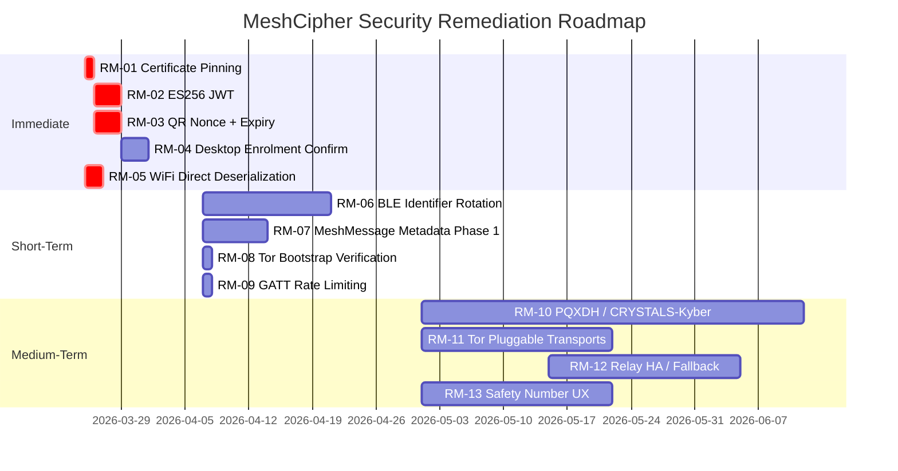

# 07 — Security Roadmap

This document connects threat model findings to the existing MeshCipher development roadmap and proposes a prioritised remediation sequence. Items are grouped by urgency and effort.

---

## Mapping to Existing Roadmap

MeshCipher's roadmap includes the following security-relevant items not yet implemented:

| Roadmap Item | Phase | Threat findings addressed | Notes |
|-------------|-------|--------------------------|-------|
| Post-quantum cryptography (CRYSTALS-Kyber, PQXDH) | — | R-09 (HNDL gap) | Kyber pre-key keys already stubbed in `SignalProtocolStoreImpl.kt` |
| MLS protocol for group messaging | — | Future group session STRIDE | Not yet analysed — introduce when implementation begins |
| Meshtastic/LoRa transport | Phase 10 | New transport — full STRIDE required at design time | Long-range mesh introduces new metadata surface |
| ATAK plugin | Phase 11 | Military/field use — highest risk profile users | Requires dedicated threat model addition |

---

## Immediate Fixes (Low Effort, High Impact)

These items require minimal code changes and address confirmed vulnerabilities.

### RM-01: Certificate Pinning on OkHttp Client

**Gap:** GAP-03 | **Risk:** R-04 | **Effort:** 1–2 hours

Add `CertificatePinner` to the OkHttp client in `InternetTransport.kt`. Pin to the relay server's leaf certificate or SPKI hash. Include a backup pin for rotation events.

```kotlin
// Example addition to OkHttpClient.Builder():
.certificatePinner(
    CertificatePinner.Builder()
        .add("relay.meshcipher.example", "sha256/<leaf_pin>")
        .add("relay.meshcipher.example", "sha256/<backup_pin>")
        .build()
)
```

Already flagged in `SECURITY_AUDIT_GUIDE.md`. No logic changes required.

---

### RM-02: Switch Relay JWT to Asymmetric (ES256)

**Gap:** GAP-04 | **Risk:** R-05 | **Effort:** 4–8 hours

Replace HS256 with ES256 on the relay. Relay signs tokens with an EC private key; clients verify using the embedded public key. Relay server compromise no longer yields token forgery capability.

- Relay: generate ES256 keypair, expose public key at `GET /api/v1/auth/public-key`
- Android client: fetch and pin public key on first run; verify JWT signature locally
- Reduces JWT expiry to 7 days (currently 30 days)

---

### RM-03: QR Enrolment — One-Time Nonce + Timestamp Validation

**Gap:** GAP-05 | **Risk:** R-06 | **Effort:** 1–2 days

Three changes:
1. **Timestamp validation** — Android rejects `DeviceLinkRequest` where `timestamp` is older than 5 minutes. Immediate fix, one-line check.
2. **One-time nonce** — Desktop generates a random 32-byte nonce and includes it in the QR. On first scan, Android consumes the nonce (marks it used in local DB or via a relay-mediated endpoint). Subsequent scans with the same nonce are rejected.
3. **QR expiry UI** — Desktop auto-dismisses QR after 60 seconds, requiring user to regenerate. Reduces the attack window for shoulder surfing.

---

### RM-04: Desktop Enrolment Confirmation Step

**Gap:** GAP-06 | **Risk:** R-06 | **Effort:** 1–2 days

After Android approves a linked device, Android sends a confirmation message (signed with identity key) to the desktop via relay. Desktop shows a confirmation dialog with the Android device name. User must confirm on both sides for enrolment to complete. Eliminates rogue device enrolment without user interaction on the desktop.

---

### RM-05: Replace Java Deserialization on WiFi Direct

**Gap:** GAP-07 | **Risk:** R-07 | **Effort:** 1–2 days

Replace `ObjectInputStream`/`ObjectOutputStream` with a typed binary protocol. Suggested format:

```
[1B message type] [4B payload length, big-endian] [N bytes payload]
```

Payload is a protobuf or simple hand-rolled binary structure. No reflection, no gadget chain surface. The `WifiDirectMessage` sealed class hierarchy maps cleanly to a fixed set of message type bytes.

This also future-proofs the transport for Kotlin Multiplatform (Java Serializable is Android/JVM-only).

---

## Short-Term (Medium Effort, High Impact)

### RM-06: BLE Identifier Rotation

**Gap:** GAP-01 | **Risk:** R-01 | **Effort:** 1–2 weeks

Implement epoch-based pseudonymous identifiers for BLE advertisements. Replace stable `SHA-256(deviceId)` and `SHA-256(userId)` with time-rotating pseudonyms derived from a shared secret.

**Approach:**
- Each pair of contacts shares a symmetric key (derived from the Signal session or a separate BLE identity key)
- Per-epoch pseudonym = HMAC-SHA256(shared_key, floor(timestamp / epoch_duration))
- Epoch duration: 1 hour (balance between tracking resistance and peer recognition latency)
- Contacts can recognise each other's advertisements; passive scanners see different values each epoch

**Note:** This requires a key bootstrap mechanism for new contacts before they can recognise each other via BLE. A reasonable approach is to use a companion BLE beacon visible only after a Signal session is established.

---

### RM-07: MeshMessage Routing Metadata Minimisation

**Gap:** GAP-02 | **Risk:** R-02 | **Effort:** 1–3 weeks

Phased approach:

**Phase 1 (quick win):** Remove the `path` field from `MeshMessage`. Use TTL-only flood routing. Eliminates the ability of relay nodes to reconstruct full routing paths. Loop prevention handled by UUID dedup (already implemented). Loss: explicit loop detection and route debugging. Acceptable trade-off.

**Phase 2 (full fix):** Encrypt routing headers — `originDeviceId`, `originUserId`, `destinationUserId` — using the recipient's Signal public key (these are derivable from the X3DH identity key). Relay nodes see only the encrypted payload and a routing tag that allows them to determine reachability without reading the full identities. This requires a design change to the routing protocol.

---

### RM-08: Tor Bootstrap Verification Before Sending

**Gap:** GAP, TOR-S-02 | **Risk:** R-12 | **Effort:** 2–4 hours

Before routing any relay traffic through `localhost:9050`, verify:
1. Orbot is installed and running (`PackageManager` check + IPC)
2. Tor bootstrap is complete (poll `/status/bootstrap-phase` or listen for `STATUS_CLIENT BOOTSTRAP PROGRESS=100`)
3. The process bound to port 9050 is Orbot (check process name via Android process inspection)

If verification fails, display an explicit warning and block the send (do not silently fall back to direct internet).

---

### RM-09: GATT Server Per-Peer Rate Limiting

**Risk:** R-14 | **Effort:** 4–8 hours

Add per-connection rate limiting to `GattServerManager`. Track message count per GATT client address per time window (e.g., 10 messages per 5 seconds). Disconnect and blacklist clients that exceed the limit. Prevents single-device GATT flooding DoS.

---

## Medium-Term (High Effort, Critical Impact)

### RM-10: Post-Quantum Cryptography (CRYSTALS-Kyber / PQXDH)

**Gap:** GAP-08 | **Risk:** R-09 | **Effort:** 4–8 weeks

**Current state:** `SignalProtocolStoreImpl.kt` already includes stub storage keys for Kyber pre-keys (`kyber_prekey:{id}`), indicating this was anticipated. The X3DH key agreement layer needs to be upgraded to PQXDH.

**Approach (following Signal's PQXDH specification):**
1. Add CRYSTALS-Kyber-1024 to the identity bundle alongside the existing X25519 signed pre-key
2. Key agreement: `K = KDF(X25519_output || Kyber_KEM_output)` — hybrid ensures security if either primitive is broken
3. Update `PreKeyBundle` to include Kyber public key and Kyber signed pre-key
4. Update relay pre-key registration/fetch endpoints to handle larger bundles
5. Require `libsignal-client` version with PQXDH support (check Signal's release timeline)

**Protects against:** HNDL — ciphertext captured today cannot be decrypted by a future quantum adversary because breaking the hybrid requires breaking both X25519 and Kyber simultaneously.

**Reference:** Signal PQXDH specification: https://signal.org/docs/specifications/pqxdh/

---

### RM-11: Tor Bridge / Pluggable Transport Support

**Gap:** GAP-09 | **Risk:** R-11 | **Effort:** 2–4 weeks

Integrate `obfs4` or Snowflake pluggable transports via `tor-android`. Add a settings screen for bridge configuration. Allow users to enter bridge addresses manually or fetch from `bridges.torproject.org`. Directly addresses MeshCipher's core use case in censored environments.

---

### RM-12: Relay HA / Multi-Region Redundancy

**Risk:** R-13 | **Effort:** 2–4 weeks

The Oracle Cloud Free Tier single instance is a SPOF. Options:
- **Option A:** Deploy a second relay instance in a different region; client uses both with round-robin or primary/backup configuration
- **Option B:** Allow users to configure alternative relay servers (self-hosted or community) — federation model
- **Option C:** Prioritise offline transports (P2P Tor, BLE, WiFi Direct) more aggressively in Smart Mode so users naturally fall back when the relay is unavailable

Option C is the lowest effort and reinforces the architectural goal of relay independence.

---

### RM-13: Safety Number Verification UX Improvements

**Risk:** R-08 | **Effort:** 2–4 weeks

TOFU is unavoidable at first contact, but reducing unverified session risk requires UX investment:
1. **First-message warning** for unverified contacts: "Safety numbers not verified. Tap to verify before sending sensitive information."
2. **Automatic nudge** after N messages with an unverified contact
3. **QR verification flow** — improve the safety number comparison UX; add QR-based verification (scan each other's QR instead of reading 60 digits)
4. **Verification badge** in the contact list so users can distinguish verified from unverified contacts at a glance

---

## Roadmap Summary



---

## New Transport STRIDE Requirements

When Phase 10 (Meshtastic/LoRa) and Phase 11 (ATAK plugin) are implemented, dedicated threat model files should be added **before code is merged to main**:

- `03-stride-analysis/stride-lora-meshtastic.md`
- `03-stride-analysis/stride-atak-plugin.md`
- `04-attack-trees/` — new attack trees as needed
- `06-risk-register.md` — new risk rows added

LoRa in particular introduces a new long-range RF metadata surface. The same identifier rotation and routing header privacy concerns from BLE mesh apply, potentially at higher severity due to the longer range (~km) enabling wider-area presence tracking.
